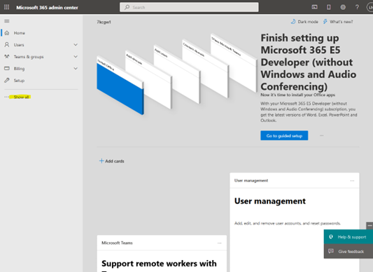
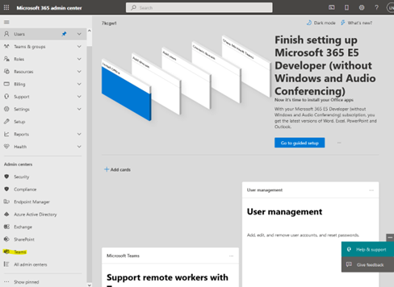
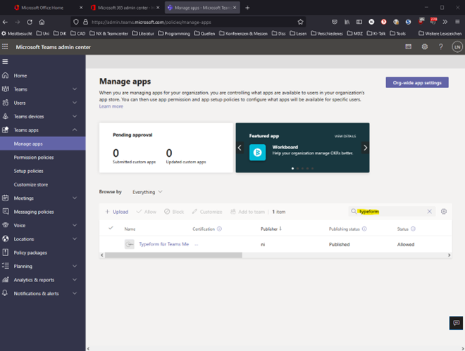
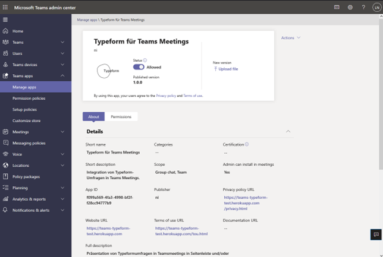

# Minimal Teams Meeting Sidebar allowing ot add Typeform

## Deploy

You have to add a valid domain to via an environment variable e.g.:

````
VALIDDOMAIN=xyz.typeform.com
````

## Teams Installation (Manifest)

1. Klick



2. Klick



3. Klick


4. Klick, Suchfeld kann man mit Tab erreichen, zählt nicht als Klick



5. Klick  auf Freigabe hier natürlich schon erledigt


